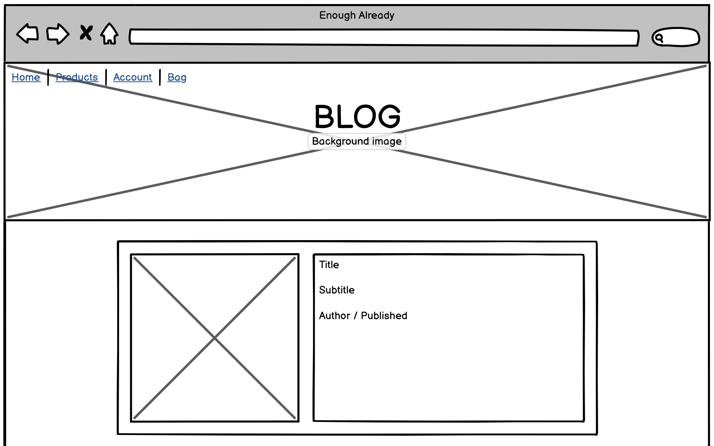
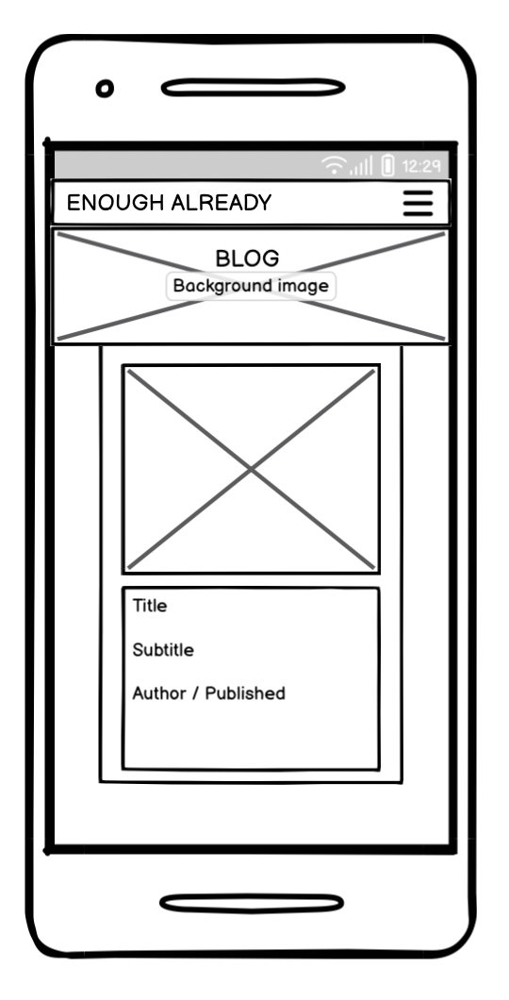
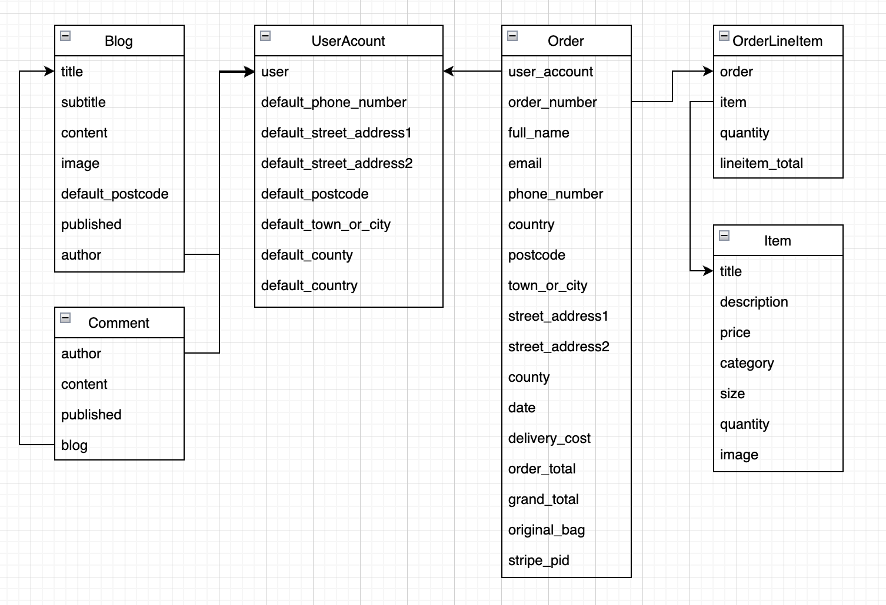
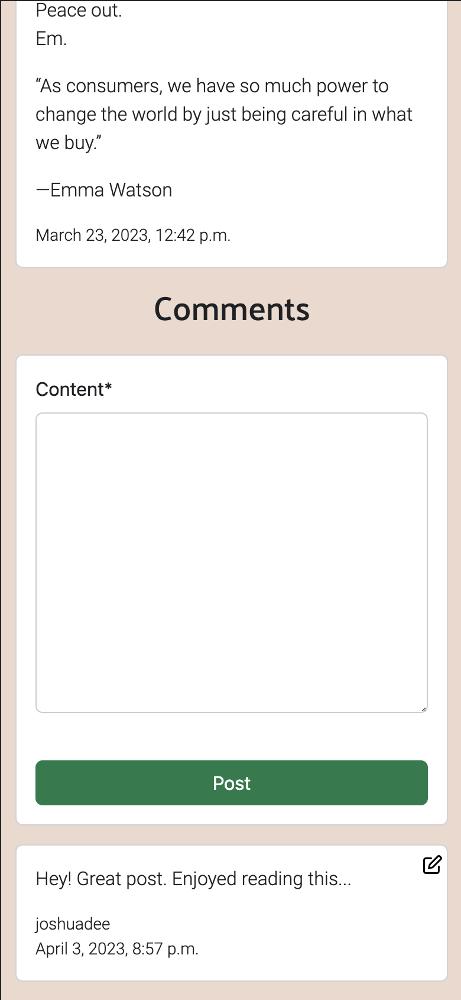

<h1 align="center">Enough Already</h1>

Enough Already is a full stack ecommerce web application that follows real world business logic, aiming to fulfil the needs of users and customers with various aims.

View live site [here](https://enough-already.herokuapp.com/).

# Features 
- Interactive web application that is responsive on all display sizes
- Authentication system, provided through django allauth
- A full ecommerce application that displays products, allows the user to add them to a shopping bag before checking out and purchasing the items
- Payments through STRIPE integration
- SQL Database (PostgreSQL)
- Demonstrates full CRUD functionality
    - Ecommerce:
        - Create orders
        - Read product details
        - Update delivery details in user account
        - Delete products from shopping bag
    - Blog:
        - Create blogs and comments
        - Read blogs and comments
        - Update blogs and comments
        - Delete blogs and comments

# UX

## User Stories
- First Time Visitor
    - I want to understand what the business is and their core values.
    - I want to see the products that the business offers.
    - I want to be able to view individual product details to inform a purchase decision.

- Returning Visitor
    - I may want to create an account with the business if I am interested in the brand.
    - I want to be able to purchase items by adding them to a shopping bag, then processing through a checkout.

- Frequent User
    - I want to create an account to enhance my shopping experience.
    - In my account I want to be able to view my order history.
    - I want to be able to store my delivery information to make the checkout process faster and easier.
    - I want to interact with the brand by reading blogs and leaving comments.

## Frontend Design
- Design Choices
    - The web app follows the principles of minimalist design — simple, uncluttered, beautiful. This is done in the hope of making the navigation of the app clear and obvious, whilst keeping the ‘spotlight’ on what matters — the products and the aims of the business. 

- Colour Scheme
    - There are 4 main colours that make up the theme of the site: #efddd4, #2d0e19, #9a115f, #d3adc5

- Typography
    - There are two fonts used for font styling. ‘Palanquin’ is used for all headings and ‘Roboto’ is used for paragraphs, with both having a backup font of ‘sans-serif’. Both fonts are provided by Google fonts.

- Wireframes 
The following wireframes were used to guide the frontend development of the e-commerce site. Below are the wireframes for the desktop and mobile layout. 

## Desktop
    - Home

    - Products

    - Product

    - Shopping Bag

    - Checkout

    - Account

    - Blog

## Mobile
- Home 

- Products 

- Product 

- Shopping Bag 

- Checkout 

- Account 

- Blog 

# Backend Design
## Products app models:
The item model, found in the products app, is used to store the details for each individual product sold in the store. This data is used throughout the app, displaying various product information when useful. The following fields make up the model.

- Item Model
    - title = a charfield that allows a title up to 99 characters.
    - description = a textfield to store the item’s description.
    - price = a decimal field to store the item price. Allows a maximum of six digits with two decimal places.
    - category = a charfield that draws on a predefined tuple (‘CATEGORY_CHOICES’).
    - size = a charfield that, again, draws on a predefined tuple that provides sizing option. 
    - quantity = an integerfield that simply stores the quantity of the product. As the store specialises in ‘one-off’ items, this is set with a default value of ‘1’.
    - image = an imagefield that stores a photo of the item.

## Checkout app models:
The ‘Order’ and ‘OrderLineItem’ model, found in the checkout app, allows the user to create an order from products created in the item model. An OrderLineItem is made up of data from the Item model, storing it's id, quantity and total. An Order is made up of OrderLineItems, totalling a grand total, and attaching shipping information and a user to the order.
- Order Model
    - user_account = a foreign key to the UserAccount model. This represents the user that placed the order.
    - order_number = This field generates a unique order number for the order and cannot be edited by the user.
    - full_name = a charfield that stores the name of the user ordering.
    - email = an emailfield that stores the email address of the user.
    - phone_number = a charfield for a contact number for the order.
    - country =  a countryfield that uses the CountryField package from django. Used to display a list of countries to simplify and make valid the address input. 
    - postcode = a charfield hat allows a postcode to be attached to an order.
    - town_or_city = a charfield to attach a town or city to the order.
    - street_address1 = a charfield to attach an address line to the order.
    - street_address2 = a charfield to attach an address line to the order.
    - county = a charfield to attach a county to the order.
    - date = a datetimefield that automatically generates when the order is placed.
    - delivery_cost =  a DecimalField that allows a delivery cost to be set. This is set with a default of zero as the business promotes free delivery on all orders.
    - order_total =  a DecimalField that stores the total of the items in the order.
    - grand_total =  a DecimalField that is generated from the order total and the delivery cost.
    - original_bag = a TextField that stores the items that were in the bag when the order was placed.
    - stripe_pid = stores the payment ID necessary for stripe integration. 
 
 
- Order Line Item Model
    - order = Foreign Key to the Order Model.
    - item = Foreign Key to the Item Model.
    - quantity = an integer that represents the quantity of the item in the order.
    - lineitem_total = a DecimalField that is not editable and is set by the save method of the model, which in turn, updates the - grand_total field in the order model.

## Accounts app models:
The UserAccount model, found in the accounts app, allows the user to create an account, where one can view their order history and update their default delivery address which will automatically appear when the logged in user progresses to the checkout page.

- UserAccount Model
    - user = a OneToOneField that connects to the built-in User model.
    - default_phone_number = a CharField that stores the account holder’s default phone number.
    - default_street_address1 = a CharField that stores the account holder’s default address number.
    - default_street_address2 = a CharField that stores the account holder’s default address number.
    - default_postcode = a CharField that stores the account holder’s default postcode.
    - default_town_or_city = a CharField that stores the account holder’s default town or city.
    - default_county = a CharField that stores the account holder’s default county.
    - default_country =  a CharField that stores the account holder’s default country, by selecting the country from the dropdown menu.

## Blog app models:
The Blog model, found in the blog app, allows users with staff permissions to create, edit, read and delete blog posts. Authenticated users are able to create, read, edit and delete comments of their own.
Unauthenticated users are able to read blogs.

- Blog Model
    - title = a CharField that stores the blog title up to a maximum of 99 characters.
    - subtitle = a CharField that stores a subtitle, providing context to the title up to a maximum of 99 characters.
    - content = a TextField that stores the main content of each blog post.
    - image = an ImageField that is used to upload an image for each blog post.
    - published = a DateTimeField that is automatically set to the current date and time when the blog post is created.
    - author = a ForeignKey to the User model, which stores the user who creates the blog post – typically the admin account as the user must have staff access.

- Comment Model
    - author = a ForeignKey that relates to the User model, representing the author of the comment.
    - content = a TextField that stores the content of the comment. A required field.
    - published = a DateTimeField that stores when the comment is made. Auto-generated. 
    - blog = a ForeignKey to connect a specific comment to the corresponding blog post.

# Technologies

## Languages and Frameworks
- HTML5
- CSS3
- JavaScript ES6
- Python
- Django
- Postgresql (production) and SQLite (development)
- Django Templating
- Bootstrap 5

## Other Tools
- Google Fonts
- Font Awesome
- Git
- GitHub
- Unsplash
- Balsamiq
- Get CSS Scan

# Testing
## Project Tests
A test driven development process was used during this project, evidenced in the commit history. The following testing was performed manually when the site was deployed. Green was given to an area if the site performed as expected. Red if there was an unexpected outcome.
- Expectation: 
    - Functionality - Could products be viewed, added to bag, checked out? Could the user create an account? Does a user with staff access have full CRUD functionailty over blog posts. Does an authenticated user have full CRUD functionality over their comments? 
    - Appearance - Did all elements display as intended?
    - Links - Do all links work and direct the user where they are supposed to? Do footer links open in a new tab?

 
 

## Code Tests
- CSS used in this application was passed through the Jigsaw CSS Validator and passed with no errors. 
    
    </img>

- HTML was passed through the official W3C validator with no issues. 

- Python was found to be PEP8 compliant, checked through the CI Python Linter. 

## Testing User Stories
### As a first time user...
- I want to understand what the business is and their core values.

The Landing page greets the user with the name of the brand. As the user continues to scroll, they are shown two simple bits of information — ‘What is Enough Already?’ and ‘Who is Enough Already?’. These simple sections introduce a first time user to the brand.

- I want to see the products that the business offers.

The navbar clearly indicates a products section. Upon the user navigating to this page, they are presented with all the products that the business has to offer. Each product is presented in its own card, displaying title, category, size and price.

- I want to be able to view individual product details to inform a purchase decision.

Once a product card is clicked, the user is taken to the details of the product, where a more in depth description of the product is displayed and the product image is made bigger and easier to view. 

 

### As a returning user...
- I may want to create an account with the business if I am interested in the brand.

If the user is not logged in or does not yet have an account, the user is given the option of registering or logging into an account. After clicking register, the user is given a form to complete and if the input is valid, the user will be granted an account after their email address has been verified.

- I want to be able to purchase items by adding them to a shopping bag, then processing through a checkout.

From the product detail page, items can be added to the bag. A message pops up to let the user know that the item has been successfully added to the bag. When viewing the shopping bag, the user can view all items in the bag and their price. Items can be deleted. The grand total can be viewed before progressing to the checkout. During the checkout, the user can complete their purchase by inputting shipping and payment information.

### As a frequent user...
- In my account, I want to be able to view my order history.

In the user’s account, their order history is displayed with each order in its own card. A new card is generated with each new order.

- I want to be able to store my delivery information to make the checkout process faster and easier. 

In the user’s account, the user can fill out the form to set their default delivery info. This will then be stored with their account and the next time the user goes to the checkout page, their delivery info will be automatically filled out with their default address.

- I want to interact with the brand by reading blogs and leaving comments.

When a user is authenticated/has an account, users are able to read blogs and leave comments, edit them if they wish and delete them if they no longer want their commetns displayed.

 
 

# Development

I used the following git commands regularly throughout the development process:

1. Git add .
2. Git commit -m “commit message here”
3. Git push

This process allowed me to push my code to a remote repository, allowing version control and a safe way of storing the code.

In order to deploy to Heroku which the next session covers, an up to date requirements.txt file and a Procfile is required. These can be generated in the following ways:

requirements.txt:
1. pip3 freeze > requirements.txt

Procfile:
1. Create a file named 'Procfile' in the root directory of the Django project.
2. Inside the file, specify the the command to run the Django app. In regards to this web app, and as we are using gunicorn, the command is:

web: gunicorn enough_already.wsgi:application

# Deployment
To deply on Heroku:

1. From the Heroku dashboard, click on the "New" button and select "Create new app".
2. Choose a meaningful name for your app and select the region closest to your location.
3. Access the "Settings" tab.
4. Click on "Reveal Config Vars".
5. Add all necessary key-value pairs from the .env file. Make sure not to include DEBUG and DEVELOPMENT variables.
6. Click on "Add buildpack" and add "python" from the list. Click "save".
7. Access the "Deploy" tab.
8. Select "GitHub - Connect to GitHub" from the deployment methods and click on "Connect to GitHub".
9. Search for the relevant GitHub repository and click it.
10. Choose automatic deploys to allow the deployed site to be updated each time code is pushed to GiHub.
11. Click "View" to view the deployed site.
The site is now deployed!

# Forking the GitHub Repository 
To create a copy of the project to experiment with changes in a safe way that will not affect the original site:

1. Log into GitHub. Go to the GitHub Repository.
2. Near the top of the Repository, click the “Fork” button in order to create a copy of the repository.

# Making a Local Clone
To create a copy of the project to experiment with changes in a safe way that will not affect the original site:
1. Log into GitHub go to the GitHub Repository.
2. Click ‘Code’.
3. To clone the repository using HTTPS, under "Clone with HTTPS", click the clipboard icon to copy the link.
4. Open Git Bash.
5. Change the current working directory to the location you want the cloned directory.
6. Type ‘git clone’, add a space, then paste the URL that was copied earlier (step 3) and press enter. This should have created a clone.

# References
Code Institute 
- Code and project informed by Code Institute tutorials and tutelage

Get CSS Scan 
- Button-74 from [here](https://getcssscan.com/css-buttons-examples)

Unsplash 
- Home page images from [Unsplash](https://unsplash.com/)

# Acknowledgments
- Many thanks to my Mentor, Spencer Barriball, for his guidance and invaluable feedback on the project.
- Tutor Support, for their constant support and patience throughout the development process.