<h1 align="center">Enough Already</h1>

Enough Already is a full stack ecommerce web application that follows real world business logic, aiming to fulfil the needs of users and customers with various aims.

View live site [here](https://enough-already.herokuapp.com/).

# Features 
- Interactive web application that is responsive on all display sizes
- Authentication system, provided through django allauth
- A full ecommerce application that displays products, allows the user to add them to a shopping bag before checking out and purchasing the items
- Payments through STRIPE integration
- SQL Database (PostgreSQL)
- Demonstrates full CRUD functionality
    - Create orders
    - Read product details
    - Update delivery details in user account
    - Delete products from shopping bag

# UX

## User Stories
- First Time Visitor
    - I want to understand what the business is and their core values.
    - I want to see the products that the business offers.
    - I want to be able to view individual product details to inform a purchase decision.

- Returning Visitor
    - I may want to create an account with the business if I am interested in the brand.
    - I want to be able to purchase items by adding them to a shopping bag, then processing through a checkout.

- Frequent User
    - I want to create an account to enhance my shopping experience.
    - In my account I want to be able to view my order history.
    - I want to be able to store my delivery information to make the checkout process faster and easier. 

## Frontend Design
- Design Choices
    - The web app follows the principles of minimalist design — simple, uncluttered, beautiful. This is done in the hope of making the navigation of the app clear and obvious, whilst keeping the ‘spotlight’ on what matters — the products and the aims of the business. 

- Colour Scheme
    - There are 4 main colours that make up the theme of the site: #efddd4, #2d0e19, #9a115f, #d3adc5

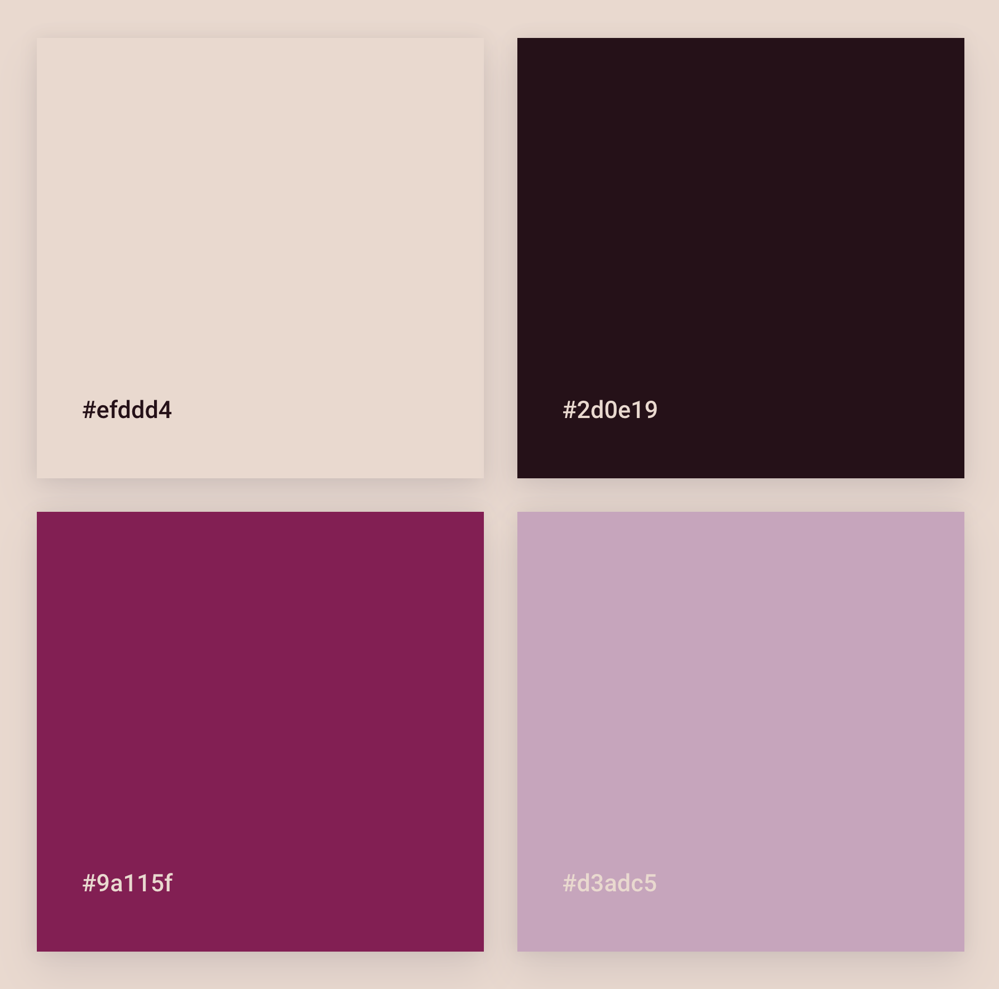

- Typography
    - There are two fonts used for font styling. ‘Palanquin’ is used for all headings and ‘Roboto’ is used for paragraphs, with both having a backup font of ‘sans-serif’. Both fonts are provided by Google fonts.

- Wireframes 
The following wireframes were used to guide the frontend development of the e-commerce site. Below are the wireframes for the desktop and mobile layout. 

## Desktop
    - Home
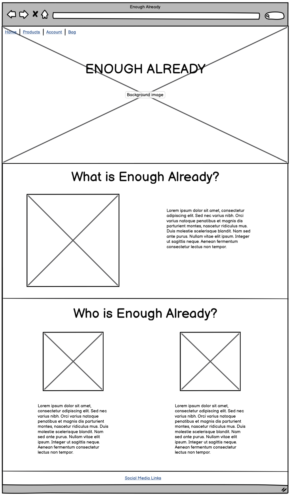
    - Products
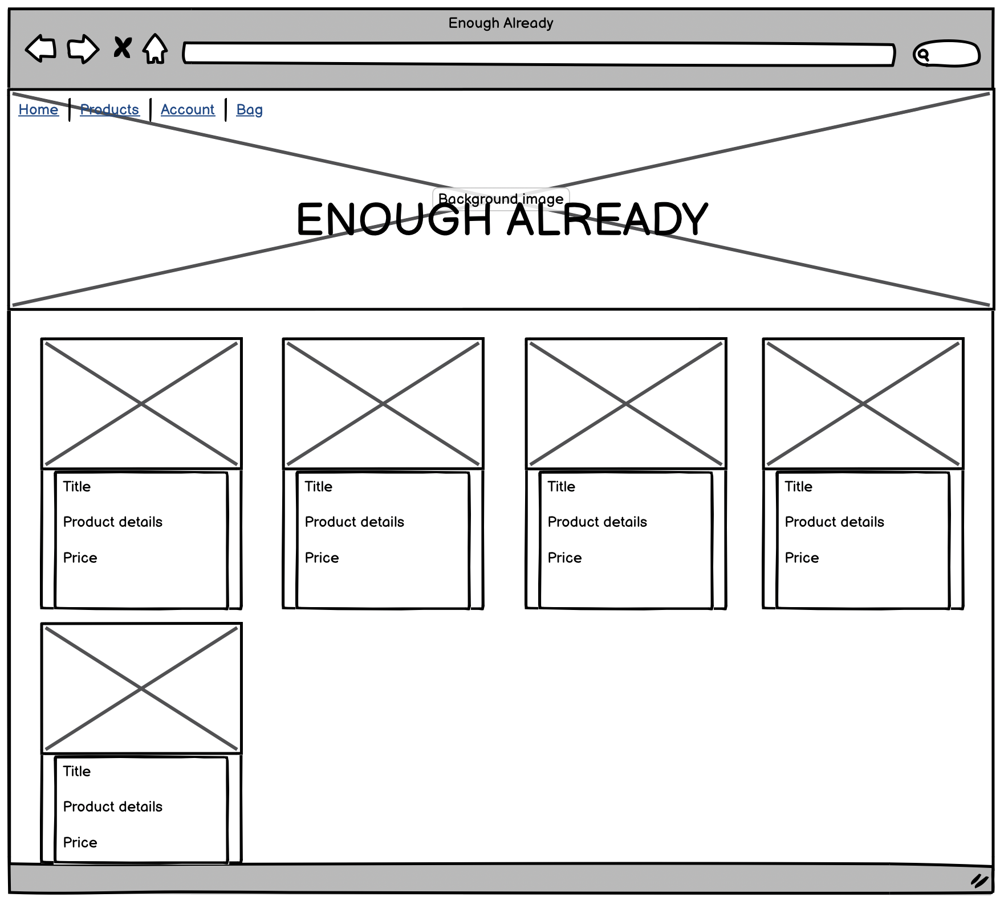
    - Product
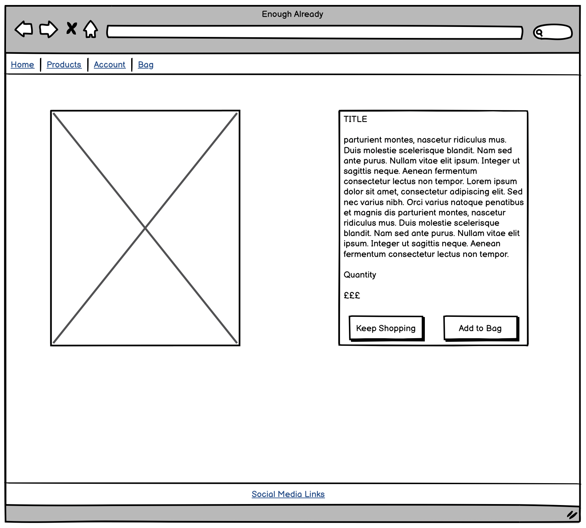
    - Shopping Bag
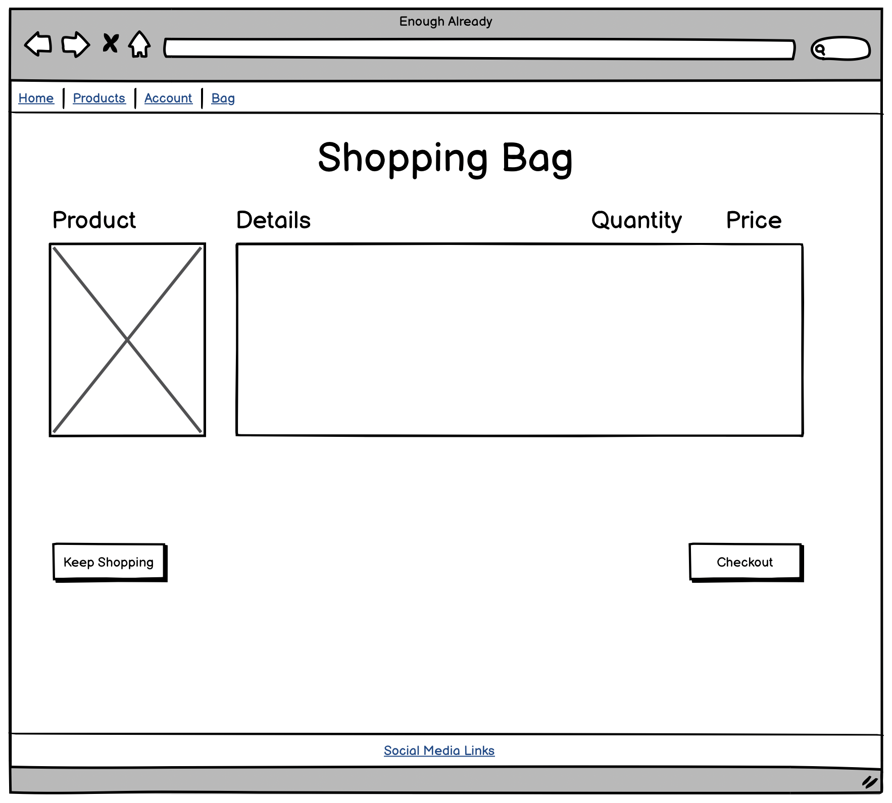
    - Checkout
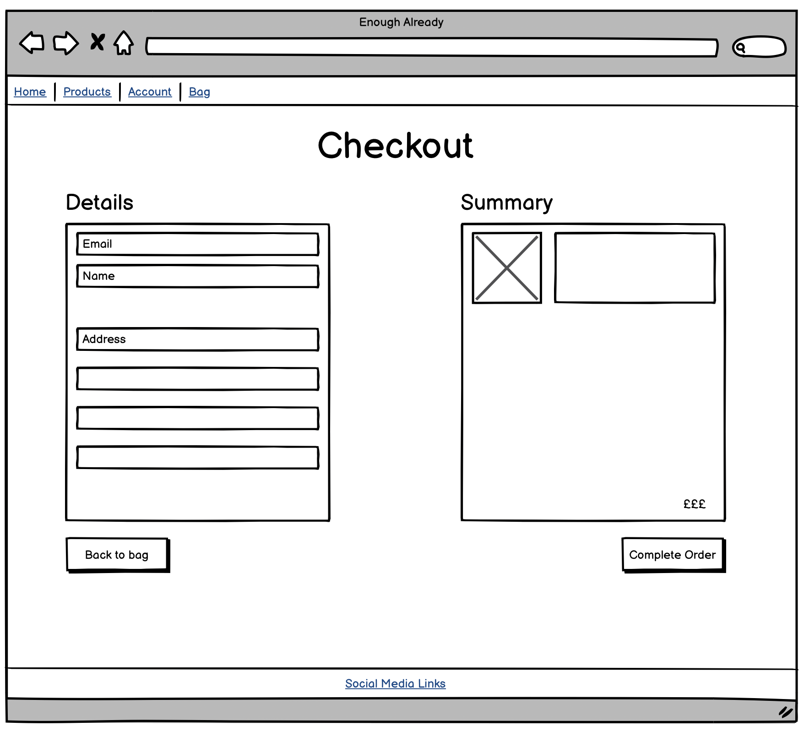
    - Account
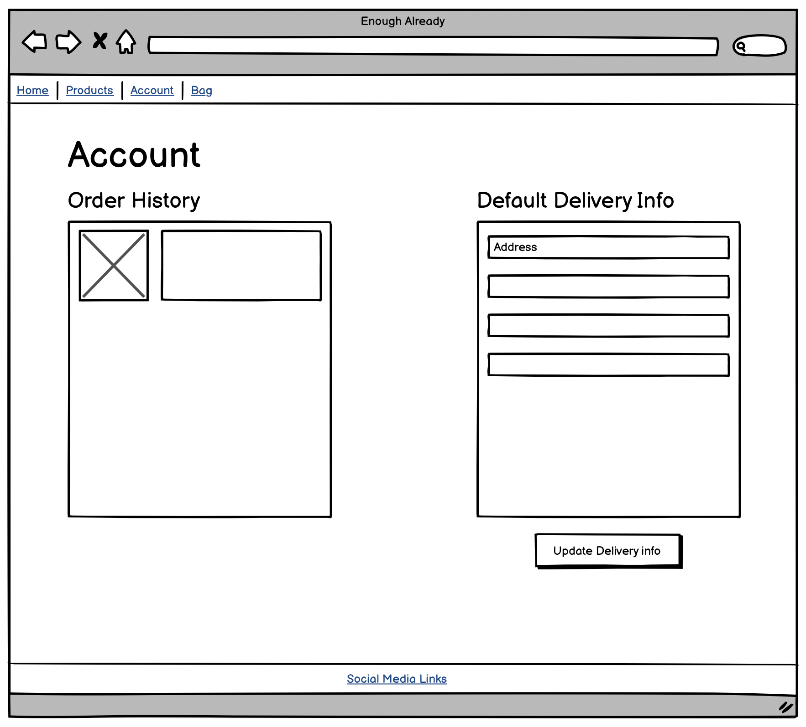

## Mobile
- Home 
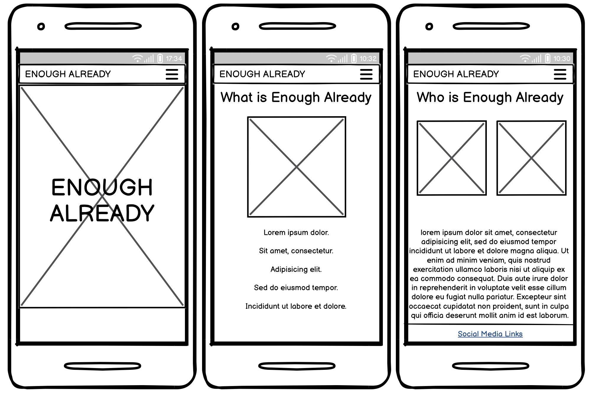
- Products 
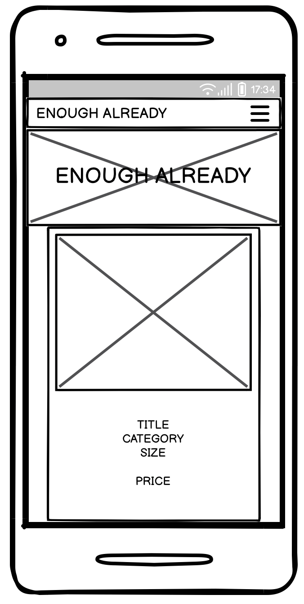
- Product 
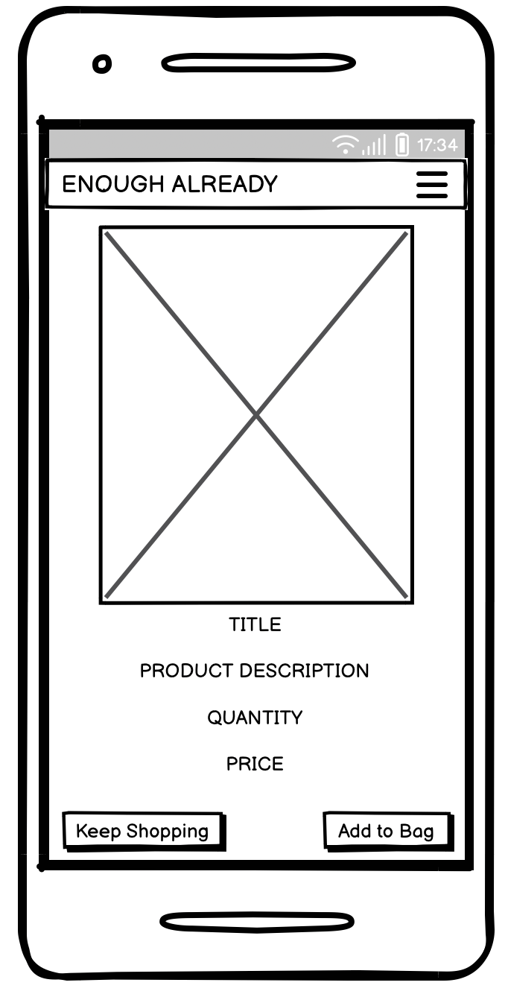
- Shopping Bag 
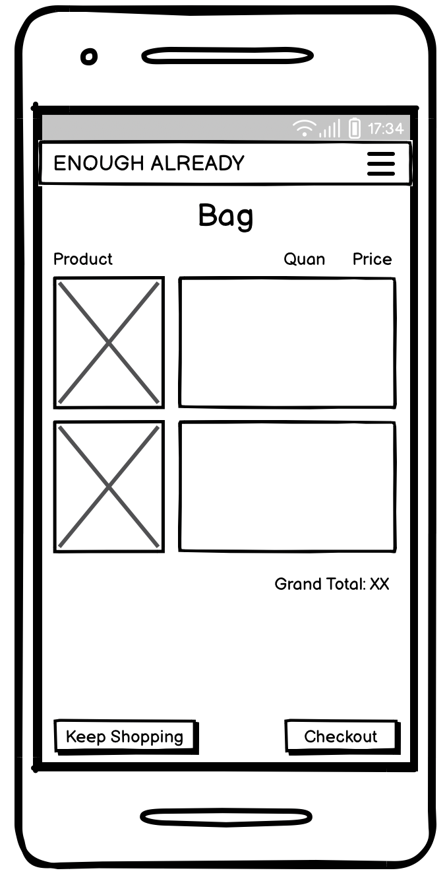
- Checkout 
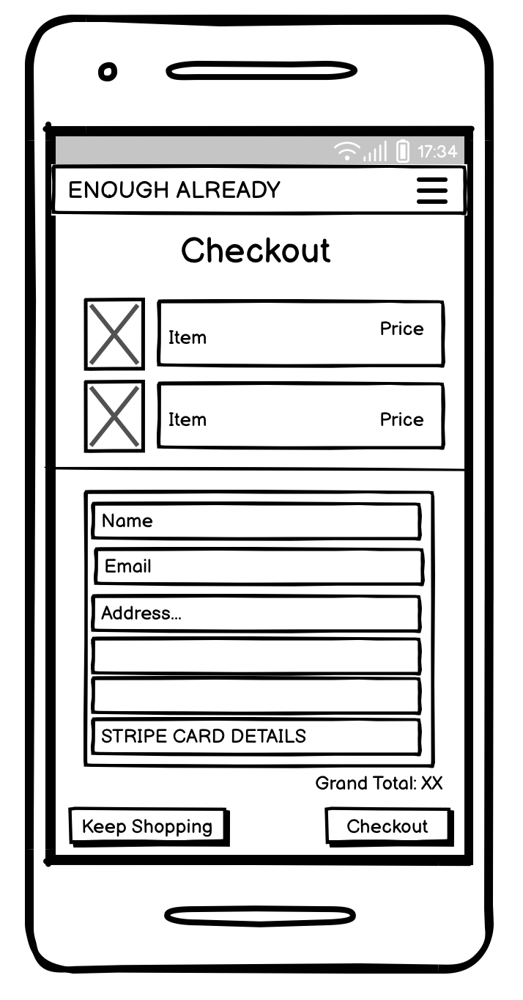
- Account 
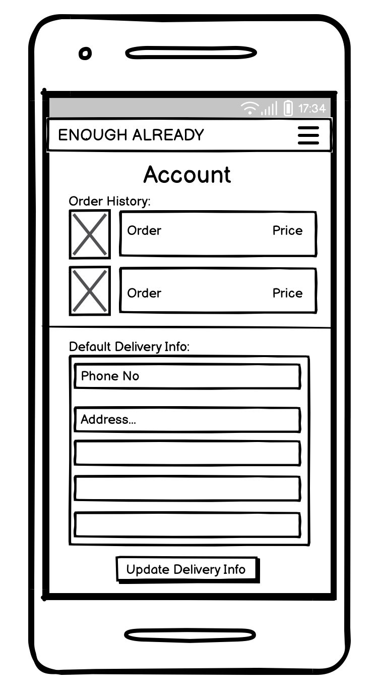

# Backend Design
## Products app models:
The item model, found in the products app, is used to store the details for each individual product sold in the store. This data is used throughout the app, displaying various product information when useful. The following fields make up the model.

- Item Model
    - title = a charfield that allows a title up to 99 characters.
    - description = a textfield to store the item’s description.
    - price = a decimal field to store the item price. Allows a maximum of six digits with two decimal places.
    - category = a charfield that draws on a predefined tuple (‘CATEGORY_CHOICES’).
    - size = a charfield that, again, draws on a predefined tuple that provides sizing option. 
    - quantity = an integerfield that simply stores the quantity of the product. As the store specialises in ‘one-off’ items, this is set with a default value of ‘1’.
    - image = an imagefield that stores a photo of the item.

## Checkout app models:
The ‘Order’ and ‘OrderLineItem’ model, found in the checkout app, allows the user to create an order from products created in the item model. An OrderLineItem is made up of data from the Item model, storing it's id, quantity and total. An Order is made up of OrderLineItems, totalling a grand total, and attaching shipping information and a user to the order.
- Order Model
    - user_account = a foreign key to the UserAccount model. This represents the user that placed the order.
    - order_number = This field generates a unique order number for the order and cannot be edited by the user.
    - full_name = a charfield that stores the name of the user ordering.
    - email = an emailfield that stores the email address of the user.
    - phone_number = a charfield for a contact number for the order.
    - country =  a countryfield that uses the CountryField package from django. Used to display a list of countries to simplify and make valid the address input. 
    - postcode = a charfield hat allows a postcode to be attached to an order.
    - town_or_city = a charfield to attach a town or city to the order.
    - street_address1 = a charfield to attach an address line to the order.
    - street_address2 = a charfield to attach an address line to the order.
    - county = a charfield to attach a county to the order.
    - date = a datetimefield that automatically generates when the order is placed.
    - delivery_cost =  a DecimalField that allows a delivery cost to be set. This is set with a default of zero as the business promotes free delivery on all orders.
    - order_total =  a DecimalField that stores the total of the items in the order.
    - grand_total =  a DecimalField that is generated from the order total and the delivery cost.
    - original_bag = a TextField that stores the items that were in the bag when the order was placed.
    - stripe_pid = stores the payment ID necessary for stripe integration. 
 
 
- Order Line Item Model
    - order = Foreign Key to the Order Model.
    - item = Foreign Key to the Item Model.
    - quantity = an integer that represents the quantity of the item in the order.
    - lineitem_total = a DecimalField that is not editable and is set by the save method of the model, which in turn, updates the - grand_total field in the order model.

## Accounts app models:
The UserAccount model, found in the accounts app, allows the user to create an account, where one can view their order history and update their default delivery address which will automatically appear when the logged in user progresses to the checkout page.

- UserAccount Model
    - user = a OneToOneField that connects to the built-in User model.
    - default_phone_number = a CharField that stores the account holder’s default phone number.
    - default_street_address1 = a CharField that stores the account holder’s default address number.
    - default_street_address2 = a CharField that stores the account holder’s default address number.
    - default_postcode = a CharField that stores the account holder’s default postcode.
    - default_town_or_city = a CharField that stores the account holder’s default town or city.
    - default_county = a CharField that stores the account holder’s default county.
    - default_country =  a CharField that stores the account holder’s default country, by selecting the country from the dropdown menu.

# Technologies

## Languages and Frameworks
- HTML5
- CSS3
- JavaScript ES6
- Python
- Django
- Postgresql (production) and SQLite (development)
- Django Templating
- Bootstrap 5

## Other Tools
- Google Fonts
- Font Awesome
- Git
- GitHub
- Unsplash
- Balsamiq
- Get CSS Scan

# Testing
## Project Tests
A test driven development process was used during this project, evidenced in the commit history. The following testing was performed manually when the site was deployed. Green was given to an area if the site performed as expected. Red if there was an unexpected outcome.
- Expectation: 
    - Functionality - Could products be viewed, added to bag, checked out? Could the user create an account?
    - Appearance - Did all elements display as intended?
    - Links - Do all links work and direct the user where they are supposed to? Do footer links open in a new tab?

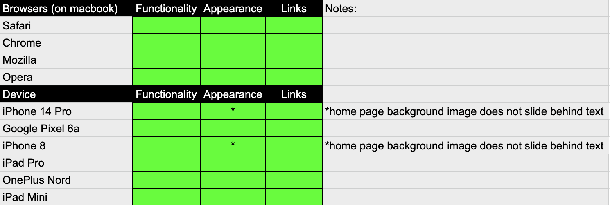
 
 

## Code Tests
- CSS used in this application was passed through the Jigsaw CSS Validator and passed with no errors. 
    
    </img>

- HTML was passed through the official W3C validator with no issues. 
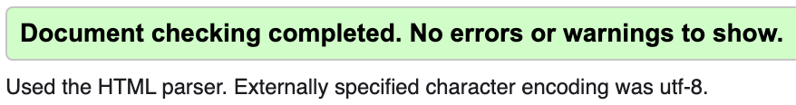

- Python was found to be PEP8 compliant, checked through the CI Python Linter. 

## Testing User Stories
### As a first time user...
- I want to understand what the business is and their core values.

The Landing page greets the user with the name of the brand. As the user continues to scroll, they are shown two simple bits of information — ‘What is Enough Already?’ and ‘Who is Enough Already?’. These simple sections introduce a first time user to the brand.

- I want to see the products that the business offers.

The navbar clearly indicates a products section. Upon the user navigating to this page, they are presented with all the products that the business has to offer. Each product is presented in its own card, displaying title, category, size and price.

- I want to be able to view individual product details to inform a purchase decision.

Once a product card is clicked, the user is taken to the details of the product, where a more in depth description of the product is displayed and the product image is made bigger and easier to view. 

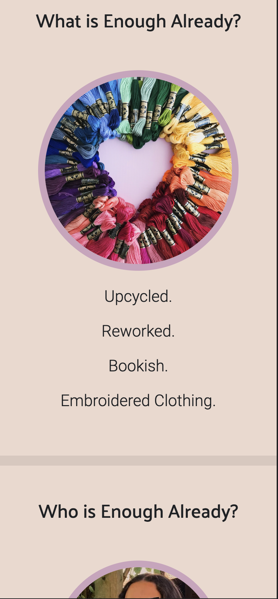
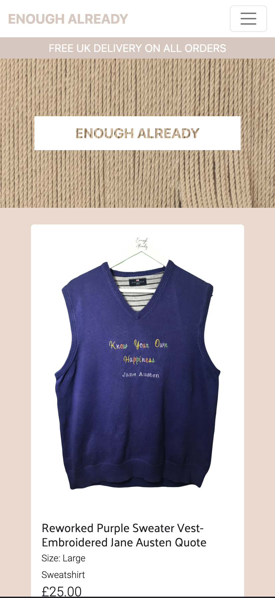
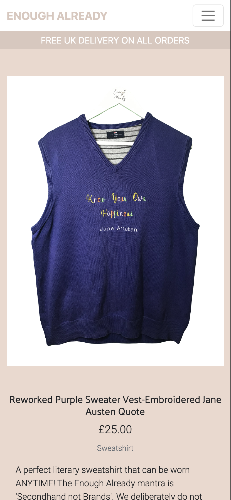

 

### As a returning user...
- I may want to create an account with the business if I am interested in the brand.

If the user is not logged in or does not yet have an account, the user is given the option of registering or logging into an account. After clicking register, the user is given a form to complete and if the input is valid, the user will be granted an account (email verification has been turned off for ease of use while marking).

- I want to be able to purchase items by adding them to a shopping bag, then processing through a checkout.

From the product detail page, items can be added to the bag. A message pops up to let the user know that the item has been successfully added to the bag. When viewing the shopping bag, the user can view all items in the bag and their price. Items can be deleted. The grand total can be viewed before progressing to the checkout. During the checkout, the user can complete their purchase by inputting shipping and payment information.

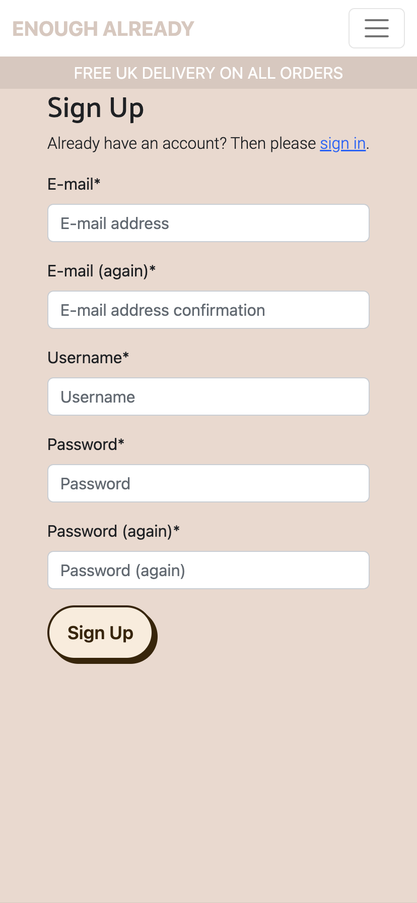
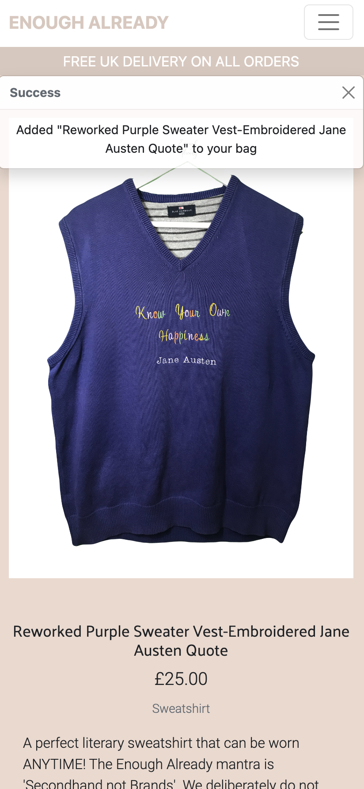
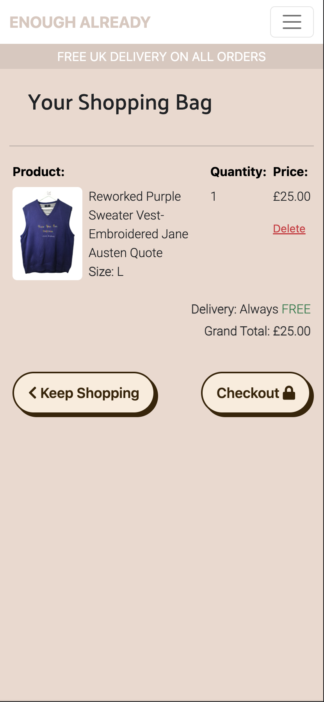
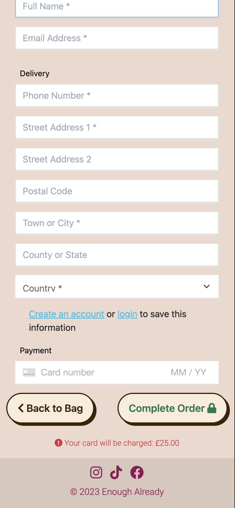

### As a frequent user...
- In my account, I want to be able to view my order history.

In the user’s account, their order history is displayed with each order in its own card. A new card is generated with each new order.

- I want to be able to store my delivery information to make the checkout process faster and easier. 

In the user’s account, the user can fill out the form to set their default delivery info. This will then be stored with their account and the next time the user goes to the checkout page, their delivery info will be automatically filled out with their default address.

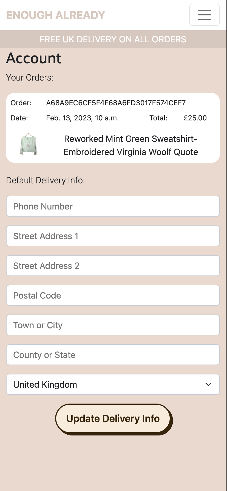
 
 

# Deployment
To deploy this web application, an account is necessary with [ElephantSQL](https://www.elephantsql.com/), [Amazon Web Services](https://aws.amazon.com/) and [Heroku](https://www.heroku.com). 

ElephantSQL
1. From the Elephant SQL dashboard, click ‘Create New Instance’.
2. Input name as ‘enough-already’, select plan, select closest region for a data centre, click review then create instance.
3. From the dashboard, click the database instance just created.
4. The URL provided will be used in the config vars of the Heroku app.

Heroku
1. From the Heroku dashboard, click ‘New’.
2. Name the app and select the closest region then click ‘create app’.
3. Next, in the settings tab, real config vars and input a key as ‘DATABASE_URL’ and value as the ElephantSQL URL that was created in the previous steps . Click ‘Add’.

Gitpod
1. Now in the Gitpod workspace, run the following commands in the CLI to install the packages needed for deployment:
2. pip3 install dj_database_url==0.5.0 psycopg2
3. pip3 install gunicon
4. pip3 install boto3
5. pip3 install django-storages
6. pip3 freeze > requirements.txt
7. Create a Procfile and input: ‘web: gunicorn enough_already.wsgi:application’

ElephantSQL
1. From the dashboard, the database must now be confirmed. To do this, click ‘Browser’ from the left navigation bar.
2. Click the table query button and select ‘auth_user (public)’ from the dropdown menu. Click ‘Execute’. 
3. Super User details should now be displayed. This also confirms your database is now ready to hold data.

Gitpod
1. Back to Gitpod. Login to heroku through the CLI by running: ‘heroku login’.
2. Next, run ‘heroku config:set DISABLE_COLLECTSTATIC=1’ in the CLI to stop it running static files during deployment.
3. Add the heroku URL to ALLOWED_HOSTS and CSRF_TRUSTED_ORIGINS in the project level settings.

Heroku
1. Once again, in the config vars in the settings tab, add a generated Django Secret Key. Enter the key as ‘SECRET_KEY’ and the value as the generated Django key that can be made from any Django key generator.

With all of these steps followed, and all code pushed to Github (with automatic deployment set up in Heroku), the site should be deployed, however, static files must still be set up. This is done through Amazon Web Services - S3.

AWS
1. From the Management Console, search services for S3 and when found, click, ‘Create Bucket’.
2. Name the bucket ‘enough-already’ and select the closest region. Uncheck ‘Block all public access’ and check the box to agree to the bucket being public. Click ‘Create Bucket’.
3. Click on the bucket that was just created. Go to properties and turn on static website hosting, entering index.html and error.html in the corresponding inputs. 
4. In the permission section, paste the below snippet to the CORS configuration then click save:

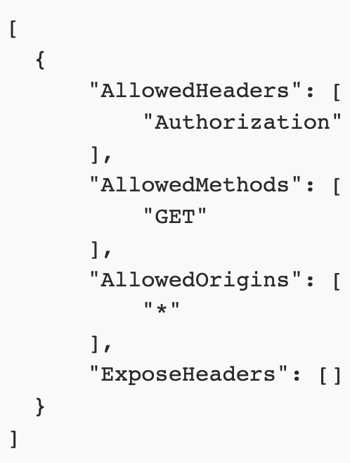

5. Next, navigate to bucket policy and click policy generator. Select the following settings: 
    - Select type of Policy: S3 Bucket Policy
    - In the ‘Principal’ input, input ‘*’.  
    - Under the actions dropdown, select ‘Get Object’
    - Copy the ARN (located in the bucket settings page in the bucket policy section) and paste it into the ARN input on the form.
    - Click ‘Add statement’ then ‘Generate Policy’.
    - Add ‘/*’ to the end of the Resource value (the ARN).
6. Copy and paste the JSON policy to the bucket policy setting. Click Save.
7. Navigate to the Access Control List, click edit and check the box enabling ‘Everyone (public access).
8. Navigate back to services and search ‘IAM’.
9. Click ‘User Groups’ from the sidebar.
10. Set group name as ‘manage-enough-already’.
11. Import managed policies then import ‘Amazon S3 Full Access’.
12. Now, using the ARN from the S3 bucket (found in bucket policy), paste it into ‘Resource’ value.
13. Review the policy by naming and providing a brief description then click create policy.
14. Now this policy must be attached to the group we already created. Click ‘User Groups’, select the group we made earlier, navigate to the permissions tab > add permissions > attach policies and attach the policy we just created and click ‘Add Permissions’.
15. Add user, entering ‘enough-already-staticfiles-user’ and give programmatic access. Click next and add our user to our group. Click through to create user.
16. Download .csv file.

Gitpod
1. Add ‘storages’ to the settings file in installed apps.
2. Paste the following snippet into settings:

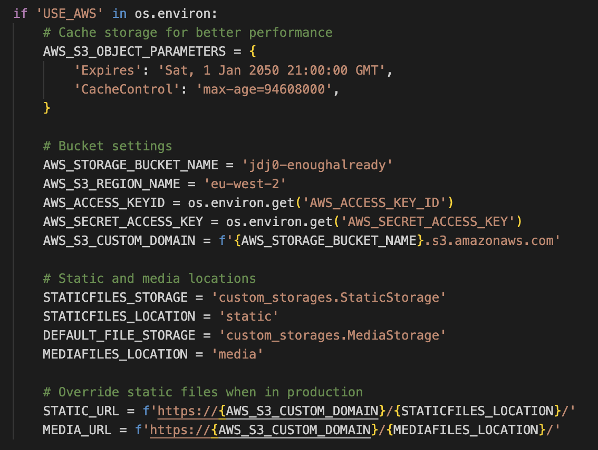

Heroku
1. Add the AWS keys and values referred to in the previous code snippet. These will all be found in the S3 Bucket and the .csv file downloaded earlier. Also, add another config var, that is simply USE_AWS and True.
2. Add Stripe Publishable and Secret keys to config vars (Remember to changed the endpoint URL in stripe for webhooks)
3. Remove the ‘Disable Collect Static’ variable from the config vars.

Gitpod
1. Add the following code snippet to a new file called ‘custom_storages.py’. 

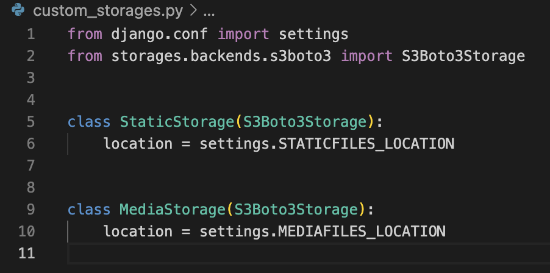

2. Push code to Github to redeploy the site with static files.

The site is now deployed!

# Forking the GitHub Repository 
To create a copy of the project to experiment with changes in a safe way that will not affect the original site:

1. Log into GitHub. Go to the GitHub Repository.
2. Near the top of the Repository, click the “Fork” button in order to create a copy of the repository.

# Making a Local Clone
To create a copy of the project to experiment with changes in a safe way that will not affect the original site:
1. Log into GitHub go to the GitHub Repository.
2. Click ‘Code’.
3. To clone the repository using HTTPS, under "Clone with HTTPS", click the clipboard icon to copy the link.
4. Open Git Bash.
5. Change the current working directory to the location you want the cloned directory.
6. Type ‘git clone’, add a space, then paste the URL that was copied earlier (step 3) and press enter. This should have created a clone.

# References
Code Institute 
- Code and project informed by Code Institute tutorials and tutelage

Get CSS Scan 
- Button-74 from [here](https://getcssscan.com/css-buttons-examples)

Unsplash 
- Home page images from [Unsplash](https://unsplash.com/)

# Acknowledgments
- Many thanks to my Mentor, Spencer Barriball, for his guidance and invaluable feedback on the project.
- Tutor Support, for their constant support and patience throughout the development process.